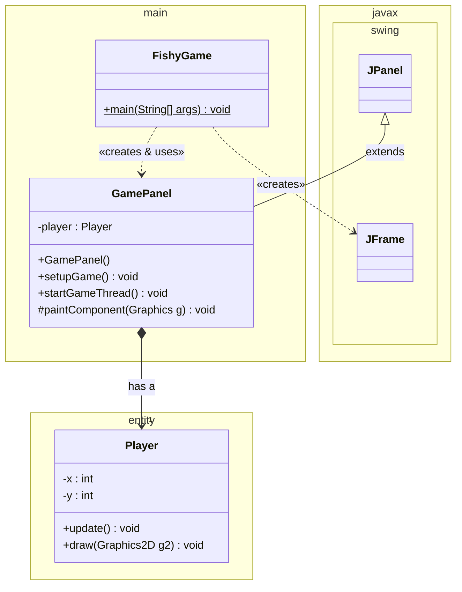

```mermaid
classDiagram
    namespace main {
        class FishyGame
        class GamePanel
    }
    namespace entity {
        class Player
    }
    namespace javax.swing {
        class JFrame
        class JPanel
    }

    JPanel <|-- GamePanel : extends
    FishyGame ..> JFrame : «creates»
    FishyGame ..> GamePanel : «creates & uses»
    GamePanel *--> "1" Player : has a

    class FishyGame {
        +main(String[] args)$ void
    }

    class GamePanel {
        -player : Player
        +GamePanel()
        +setupGame() void
        +startGameThread() void
        #paintComponent(Graphics g) void
    }

    class Player {
        -x : int
        -y : int
        +update() void
        +draw(Graphics2D g2) void
    }
```